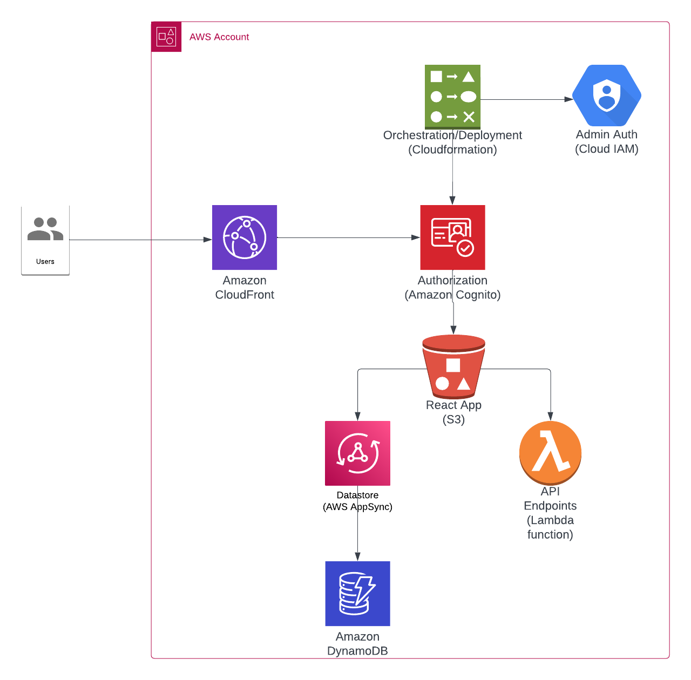

# Master Ontology

POC application for tracking clinical concepts for the Ontology team.

This POC is currently accessible at: https://d2qn35r37cyji1.cloudfront.net/

This application was designed using [AWS Amplify](https://aws.amazon.com/amplify/). Its tooling allows for quick and easy deployment of full-stack web apps, such as this one. I chose this mostly for its orchestration/deployment tools and built-in UI components.

The basic dashboard design is from [amplify-ui-dashboard](https://github.com/mrtzdev/amplify-ui-dashboard), which was used as a quick way to assemble the main UI for the app. Many of the services provided by the dashboard are still using mock data and/or are unconnected from the app at this time.

## System Diagram

AWS Amplify provides tooling and orchestration for deploying full-stack web applications using various AWS services. 

The main React application is hosted via an S3 bucket served over Cloudfront.

Authorization is handled using Cognito User Pools. Registration & authorization are required in order to use the application. Cognito will send a one-time code to the user's email address to verify the email before allowing registration to complete.

Data is stored in an DynamoDB table that is accessible using GraphQL through AppSync. Amplify provides scripts for the creation of basic CRUD queries/mutations based on the given model.

There is also an API endpoint that will run a Lambda script, but that is not currently doing anything other than returning a string to verify it is alive. These can also be hooked up to the User Pools to control access.

Deployment is handled by Amplify's `push`/`publish` scripts. This monitors changes to the local codebase and automates deployment of changes to the various services involved.

## What It Does

This is not an exhaustive list of features of Amplify, or the Dashboard used, but rather only the parts that are pertinent to the assignment.

### Basic CRUD
- List concepts via the Concept Table (/tables)
- Delete records via the Concept Table 'Delete' button
- Edit button on Concept Table redirects to the Edit Form (/edit-form/:conceptId)
- Add concepts via the Add Concept form (/forms)

### Other Features
- Header 'Logout' button signs users out of the application
- [Lambda API](https://kmqhjwev6g.execute-api.us-east-1.amazonaws.com/dev/concept/admin) available (requires authorization), currently it only returns the text "Admin View"

### What It Does *Not*
- Concept schema uses "ID" for parent/child relationships, this should be updated to be self-referential (ie, parents: [Concept!])
- Search bar is included in the list page but not hooked up to the form yet
- Parent/Child IDs are displayed in the List form instead of names
- Parent/Child relationships are not updatable via the forms - ideally this would be either some kind of lookup/search field or some kind of multiselect interface, but I didn't have time to dig deeper into that feature.
- Alternate Names are not currently surfaced.  Since this is an array of items, there was no simple UI component to use for editing these. I would design it like a 'tag' system, allowing the user to add new text input lines in order to add new names, as well as the ability to edit/delete existing names.
- While the 'edit' and 'delete' functionality is hooked up and working, it is not currently updating the page components.  They are just outputting results to the console. This means after deleting you will need to refresh the page to see the change.

## Proposals/Questions/Concerns
This is still very much a work in progress. There are a number of things I would change or update given the time. While it had a bit of a learning curve, I think that Amplify is a pretty solid base to build such an app on top of, at least at the POC level. If I had a devops team to handle deployment, it might be easier just to integrate with existing methods rather than introducing a new pipeline, and there are certain features that might be handled 'manually', but it definitely helped me to get this up and running quickly without a huge amount of coding on my part.

Given the time it did take to get the basic application running, I did not spend much time on the model itself.  The schema is a basic/naive implementation of the sample data. Given the nature of the sample data, I would have liked to set up recursive references to it, or possibly have broken it out into a more normalized design using link tables to define references. It's hard for me to say from here, but I feel like a recursive design would work but may be a bit more complicated to handle in code via graphql queries. However, Amplify is now offering graphql connections to RDS-backed datastores, which might allow for easier relationship tracking.

I also wonder if it might not be better to separate out distinct categories of concepts into their own table structure - rather than a self-referential hierarchy, it might make more sense to have a listing of disease types, for instance, which would have individual diseases as their children.

On the topic of users/groups, while there is provision for user groups within the app, there is no interface for managing those. There would definitely need to be some kind of "admin panel" to allow certain users access to update these things via UI rather than having to dig into various AWS tools' dashboards in order to update it, or redeploy the app with configuration changes.